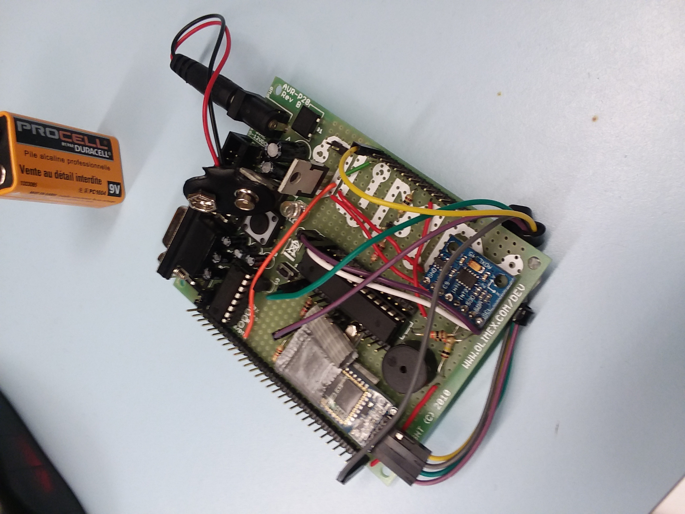
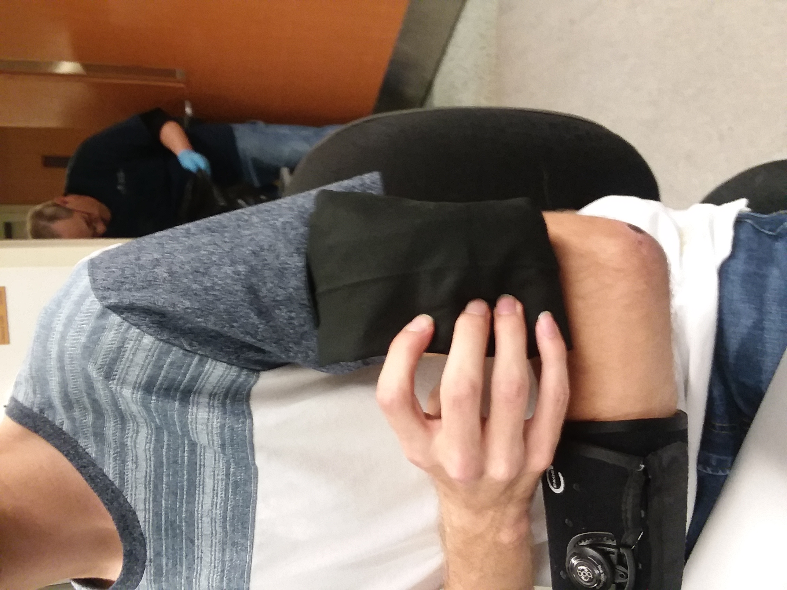
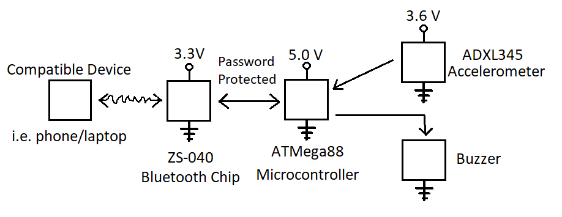

# AlertLife

Final project designed for an embedded systems class. 

A poster report can be found under https://github.com/karsonkevin2/AlertLife/blob/main/Embedded%20Poster.pptx

This is a wearable device that can detect someone falling down. When a fall is detected, the device begins emitting a noise and sends a Bluetooth signal denoting which device was triggered. The alarm can be reset remotely by authorized personnel or can be reset manually on the device. The device was designed for senior care facilities that may be understaffed and now able to monitor all residents effectively.

## The circuit board

## The device in the enclosing sleeve worn on an arm

## Circuit layout

